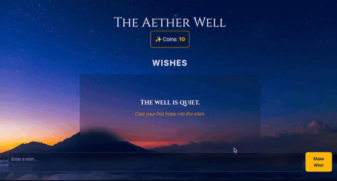
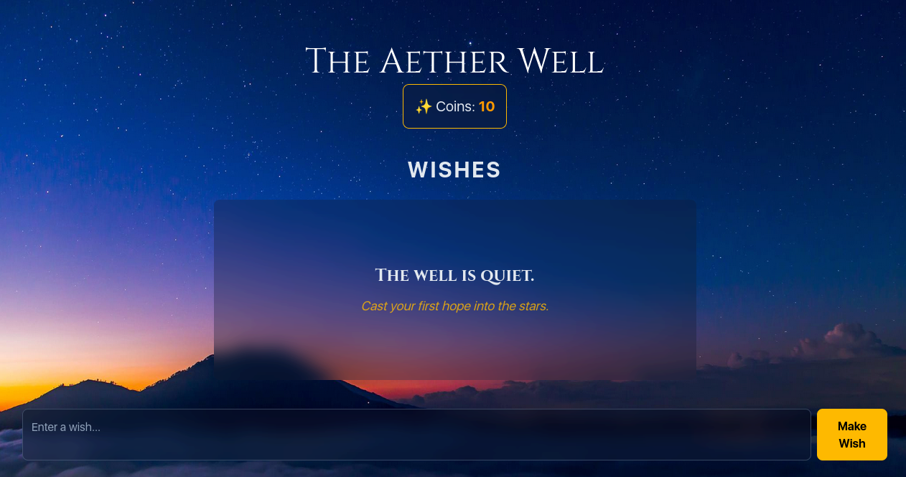

# The Aether Well ✨

**Live Demo:** [**https://aether-well.vercel.app/**](https://aether-well-your-name.vercel.app)

A serene, mindful wishing well to cast your hopes and dreams into the cosmos. This project was built with passion and persistence in under 10 hours for the HackClub Siege hackathon, battling pneumonia, exams, and the final boss of mobile CSS along the way.

_Above: The core experience – making a wish and watching it fluidly join the well._

---

## The Concept

The Aether Well is a digital, mindful experience. It is not a productivity app, but a place for quiet reflection. Users are granted a small number of virtual coins each day, which they can spend to cast a wish, goal, or hope into the well.

Over time, the well becomes a beautiful, personal collection of the user's aspirations, saved securely in their own browser's local storage.

## Core Features

*   **Daily Coin Bonus:** Users receive 5 free coins upon their first visit each day, encouraging a mindful, daily ritual.
*   **Fluid Animated UI:** Built with Svelte's powerful transition and animation engine. The coin counter satisfyingly "pops," new wishes gracefully fly into the list, and existing wishes fluidly animate to make space.
*   **Thoughtful UX:**
    *   **Multiline Wishes:** Supports expressive, multi-line wishes using `Shift+Enter`.
    *   **Action-Based Tooltip:** A helpful, non-intrusive tooltip appears if a user tries to make a wish with zero coins.
    *   **Enter to Submit:** Wishes can be submitted with the Enter key for a fast, seamless experience.
*   **Fully Responsive & Mobile-First:** A robust design that looks and works beautifully on all screen sizes, with special attention paid to handling mobile browser UI (`h-svh`) and the virtual keyboard.
*   **Polished Details:** Includes a welcoming "empty state" message for new users, robust handling of text overflow (`break-words`, `whitespace-pre-wrap`), and a custom, elegant font to match the theme.

## Tech Stack

*   **Framework:** SvelteKit (using the latest Svelte 5 Runes for state management)
*   **Styling:** Tailwind CSS v4 (configured with the new zero-config Vite plugin)
*   **Deployment:** Vercel (with continuous deployment from GitHub)

---

### Mobile View

